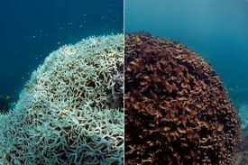

# Earth Crosses First Climate Tipping Point

Coral reefs undergo widespread die-off as global temperatures breach critical threshold


## The Tipping Point Reality

The Global Tipping Points Report 2025 confirms that warm-water coral reefs have passed their thermal survival threshold at 1.4°C above pre-industrial levels. This marks humanity's entry into a "new reality" of irreversible environmental change, with over 80% of the world's coral reefs experiencing the most extensive bleaching event on record since 2023.


### Key Climate Thresholds

<table>
  <tr>
    <th>Ecosystem</th>
    <th>Tipping Point Temperature</th>
    <th>Status</th>
  </tr>
  <tr>
    <td>Coral Reefs</td>
    <td>1.2°C</td>
    <td>✗ Crossed (1.4°C reached)</td>
  </tr>
  <tr>
    <td>Amazon Rainforest</td>
    <td>1.5°C</td>
    <td>⚠ Imminent Risk</td>
  </tr>
  <tr>
    <td>Greenland Ice Sheet</td>
    <td>1.5-2.0°C</td>
    <td>⚠ Accelerating Melt</td>
  </tr>
  <tr>
    <td>Atlantic Ocean Circulation</td>
    <td>2.0°C</td>
    <td>○ At Risk</td>
  </tr>
</table>

### Impact on Human Communities

<ul>
  <li><strong>1 billion people</strong> depend on coral reefs for food and livelihoods</li>
  <li><strong>25% of ocean species</strong> rely on coral reef ecosystems for survival</li>
  <li><strong>$2.7 trillion annually</strong> in economic value from fisheries, tourism, and coastal protection</li>
  <li><strong>84% of global reefs</strong> experienced bleaching-level heat stress in 2023-2024</li>
</ul>




---

## Climate Impact 

Understanding your region's vulnerability to coral reef collapse:
```js
const regions = [
  { name: "Caribbean", impact: "Severe coral bleaching and fishery decline" },
  { name: "Pacific Islands", impact: "Rising sea levels threaten communities" },
  { name: "Southeast Asia", impact: "Loss of reef tourism and food security" },
  { name: "Indian Ocean", impact: "Bleaching and loss of coastal protection" },
  { name: "Great Barrier Reef", impact: "Mass bleaching and coral mortality" },
  { name: "Red Sea", impact: "Heat-resistant reefs but increasing stress" }
];
```

```js
const userRegion = view(Inputs.select(regions, {
  label: "Select your coastal region:", 
  format: x => x.name,
  value: regions[0]
}));
```

You have selected the region: ${userRegion.name}

Impact: ${userRegion.impact}
