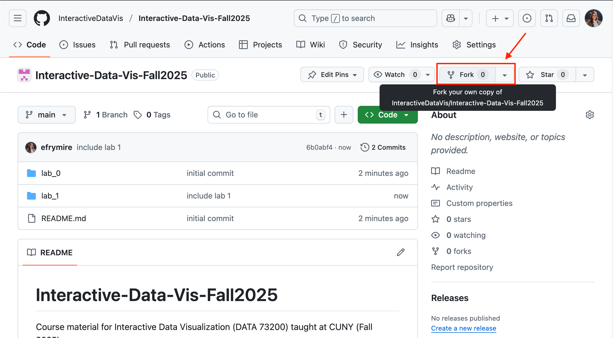
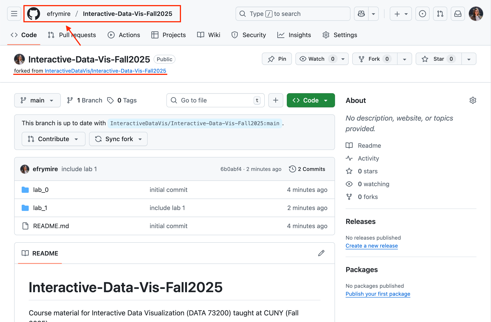
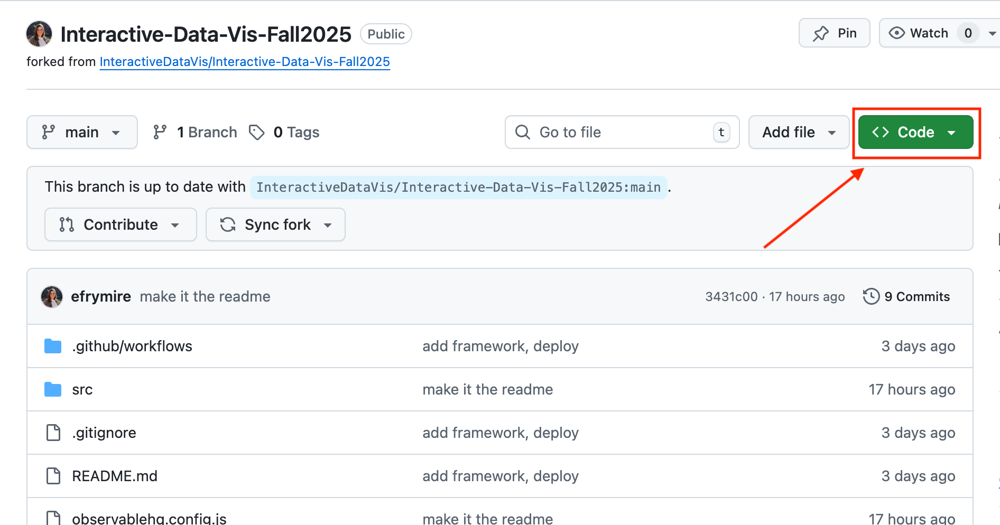
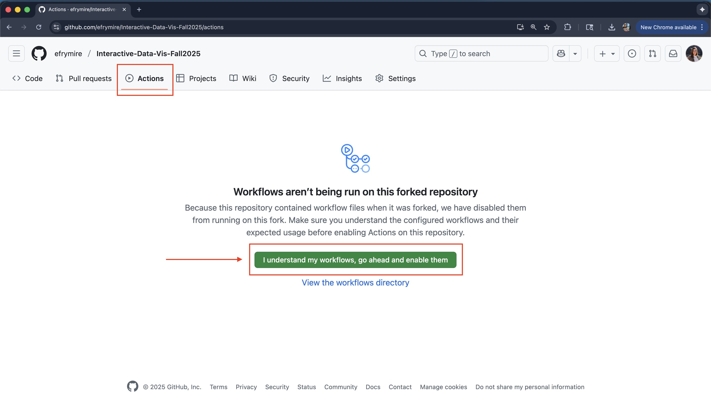
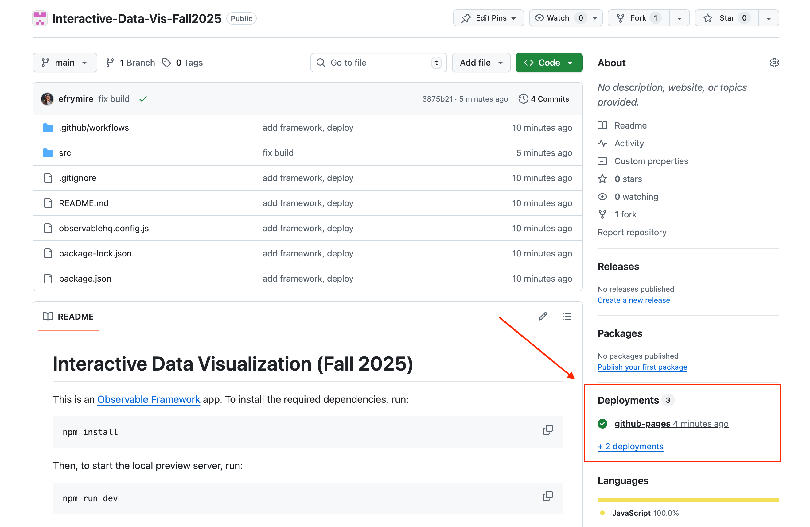
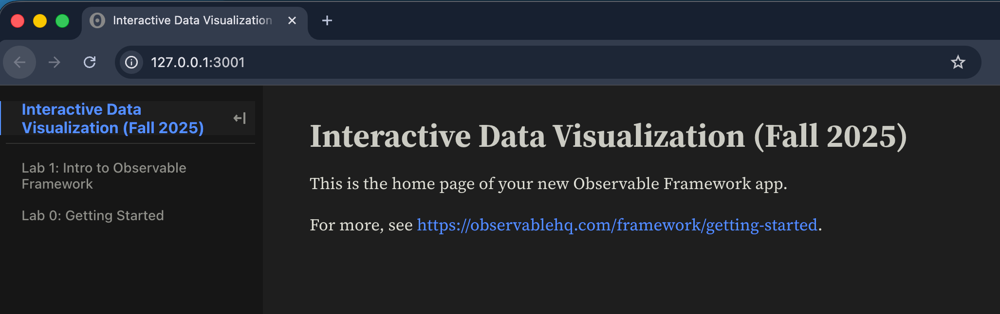
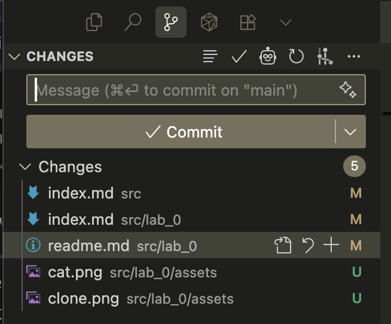
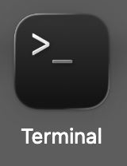
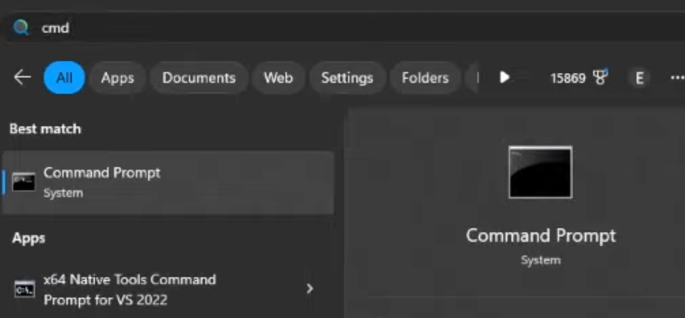

# Lab 0: Getting Started

The goals for this tutorial are:

- to set up installations for your local development environment
- to learn how to serve your pages so that you can see/interact with them while you are coding
- to get comfortable with the Github workflow
- to set up a public site to showcase your work

The assignment requirements are as follows:

1. Replicate the local environment created in class on your own computer ([Installations](#installations))
2. Fork this repository, set up github pages, and initialize your upstream repository ([Github Setup](#github-setup))
3. Edit the `index.md` file to include:
   1. Markdown: A page header (`#`), some smaller header (`##` or `###`), and some text content
   2. HTML: A table, a list, and an image
   3. JS: include at least one [`Input` element](https://observablehq.com/framework/inputs/) that changes a visible reference on the dashboard
4. Submit your [deployed link](#4-set-up-your-github-pages-for-your-deployment) as a comment on the lab 0 commons post.

---

# Installations

The first step is to install all the appropriate software to get our environment together. Please install the following on the computer you intend to complete all the labs from.

_Note_: while VS code is an application, the other softwares are installed via your terminal or bash. If this is your first time working with your terminal, check out [working with your terminal](#working-with-your-terminal).

- [VS Code](https://code.visualstudio.com/) - free code editor and IDE (my recommendation). This is an application to view files and code. This application also includes many handy extensions that can help us with [version control](https://code.visualstudio.com/docs/editor/versioncontrol#_git-support).
  - You may also use another code editor that has AI integration, like [cursor](https://cursor.com/), but these ai integrations typically require payment after reacting an interaction limit.
- [Git](https://git-scm.com/book/en/v2/Getting-Started-Installing-Git) version control software. You will also need an account on [Github.com](https://github.com/).
  - if you have a mac, and you have installed Xcode, you _already have git_. You can test this by opening your terminal and running `git --version`.
  - if you are using a PC, an application called "git bash" will be part of the default git install. You may prefere to use this application rather than the "command prompt" for git commands.
  - all installation details are included in the [Getting Started Installing Git link](https://git-scm.com/book/en/v2/Getting-Started-Installing-Git).
  - an alternative for both mac and pc is to use the [source control](https://code.visualstudio.com/docs/editor/versioncontrol#_git-support) options that come with the default VS Code installation. This is often easier than opening terminal each time and offers many of the same actions.
- [Node](https://nodejs.org/en/download/) - javascript development software. You can check if the install was succesful by running `node -v` in your command line or terminal. It should return your version number.
  - Node installation includes node package manager (npm), which we will leverage to install Observable Framework and its dependencies.

# Github Setup

You can read more about `forking`, `syncing`, and the overall github flow [here](https://help.github.com/en/github/getting-started-with-github/fork-a-repo).

## 1. On Gitub, within to our [main repository](https://github.com/InteractiveDataVis/Interactive-Data-Vis-Fall2025.git) and [`fork`](https://docs.github.com/en/github/getting-started-with-github/fork-a-repo) this repository into your own account.

To do this, click on the "fork" button on the top right of this github account.



This creates a clone of our class repository in your own github account. After the fork, you can see this worked by confirming your github username appears before the repository name:



This repository is _your_ personal copy of the existing repository. This will be where you do all your lab work, and will include the deployed links that you will submit when turning in your assignments.

## 2. On GitHub, navigate to **your fork** of the repository, clone it to your local computer, and install dependencies.

To do this, navigate to the folder where you want to save your files (I like to save mine in `Documents/Repositories`). (Hint: `cd` or 'change directory' will help you get there through terminal). Then use the `git clone` command and paste the git url from the big green "code" button:



Copy the link inside there and use it after the `git clone` command in the terminal details below:

```sh
# from Terminal:

# navigate to where you want to save your code
$ cd PATH_TO_YOUR/FOLDER

# clone your fork to your local computer
$ git clone https://github.com/[YOUR_USERNAME]/Interactive-Data-Vis-Fall2025

# `cd` (change directory) into this repository
$ cd Interactive-Data-Vis-Fall2025
```

## 3. Set up your local repository so that it links back to the course repository.

We do this so that you can keep your local branch synced up with the main course repository when we update the material. With this set up, you can simply `pull` in the new changes from our original class repository.

```sh
#See current remote branches:

$ git remote -v
> origin	https://github.com/[YOUR_USERNAME]/Interactive-Data-Vis-Fall2025.git (fetch)
> origin	https://github.com/[YOUR_USERNAME]/Interactive-Data-Vis-Fall2025.git (push)

# currently this is only tracking your version of the repository
```

Add an `upstream` remote branch so you can keep yours synced with the main class repository:

```sh
$ git remote add upstream https://github.com/InteractiveDataVis/Interactive-Data-Vis-Fall2025.git
```

Check remote branches again to ensure that the update worked. You should see 2 sets of branches, `origin` which links back to your fork, and `upstream` which references back to the course repository:

```sh
$ git remote -v
> origin	https://github.com/[YOUR_USERNAME]/Interactive-Data-Vis-Fall2025.git (fetch)
> origin	https://github.com/[YOUR_USERNAME]/Interactive-Data-Vis-Fall2025.git (push)
> upstream	https://github.com/InteractiveDataVis/Interactive-Data-Vis-Fall2025.git (fetch)
> upstream	https://github.com/InteractiveDataVis/Interactive-Data-Vis-Fall2025.git (push)

# now we are tracking both the original and your version of the repository
```

## 4. Set up your Github Pages for your deployment

We use [Github Pages](https://docs.github.com/en/pages/getting-started-with-github-pages/what-is-github-pages) to serve our websites publicly. Github Pages is static site hosting service that takes HTML, CSS, and JavaScript files straight from a repository on GitHub, optionally runs the files through a build process, and publishes a website.

To [set up your github pages site](https://docs.github.com/en/pages/getting-started-with-github-pages/creating-a-github-pages-site#creating-your-site), you can go to your repository's `Settings` tab and then scroll down to `Pages` section. Select `Github Actions` as source ("Deploy from a branch").


The workflow code is already included in the main class repository, but disabled by default. The workflow file is something called a `.yml` file, located in the `.github` file at `.github/workflows/deploy.yml`. This workflow includes instructions telling github to build and deploy your app whenever you push to main. You shouldn't have to change this file at all, but here's the key commands of the file for your understanding:

```yml
on:
  # Run this workflow whenever a new commit is pushed to main.
  push: {branches: [main]}

jobs:
  # define the job
  deploy:
    ...
    steps:
      - run: npm run build # builds the app
      ...
      - name: Deploy # run the github deploy pages action
        id: deployment
        uses: actions/deploy-pages@v4

```

To deploy your app on push, you need to enable these workflows. Navigate to the "actions" tab, and click "I understand my workflows, go ahead and enable them". The app will now deploy on push.



When you push your changes up to github, then your site will automatically be redeployed and be avallable at `https://[YOUR_USERNAME].github.io/[YOUR_REPOSITORY_NAME]/`.

Once you have pushed a change, you can see all the deployments triggered from pushed in the deployments section of your repository page. These will not be triggered until you make a change to your repo and push it back up to github.



_NOTE_: You must navidate in the URL to a folder with an index.html, or else you will get a 404. This will take a few minutes to update with any pushed changes.

## 5. Install dependencies and begin local development

The cloned repository already has packages and dependencies set up to get started with Observable Framework. The `package.json` file includes the details of the packages required to begin development.

To install and get started, run the following in your terminal:

```sh
# within the repository directory, install the packages
$ npm install

# attempt to enter development
$ npm run dev

> dev
> observable preview
> Observable Framework v1.13.3
> ↳ http://127.0.0.1:3001/
```

Your terminal will now begin serving the code at the listed url. This can be [`http://127.0.0.1:3000/`](http://127.0.0.1:3000/) or another port (e.g., `:3001`). The listed url in your terminal is where your code is served. Navigate to that link in your browser. You should see the code from the class repository.

To exit out of this live updating serve, in the terminal window in which the serve is taking place, type `CNTRL` or `CMMD` + `c`



## 6. Push up and deploy your changes

When you have made a change that you want to keep, you can commit your changes. VS Code has some great [tools](https://code.visualstudio.com/docs/editor/versioncontrol#_git-support) built in to help with this process, which are a bit easier, or you can leverage the command line.

**To use VS Code tools**:



1. Open the "version control" panel on the left side of your application. You should see a list of changes and a place to add a comment.
2. Click on the "+" next to each change to add it to the staged changes.
3. Add a comment about your work, then click "commit". Just because you have committed the changes does not mean they are pushed to your repository yet.
4. Click the three dots and click "push" to send your commit to github.

**To use the command line**:

```sh
# see which files have changes associated with them
$ git status

# add, or 'stage', files or folders for this commit
$ git add [path/fileName]
# you can also do the shorthand git add . to add all files

# commit the files with a brief explanation of what you are changing
# ex: `git commit -m 'add bar chart legend`
$ git commit -m 'message regaring what changes you are commiting'
```

When you are ready to push up your code to your remote repository, you can run:

```sh
$ git push
```

**That's it! Now you are ready to create, update, and deploy your own dashboards 🎉!**

# Appendix

### Working with your terminal

Your computer, mac or pc, includes a command line interface that lets you communicate with your operating system. For macs, that app is called "terminal", and on windows machines, its the "command prompt".




More resources to understand these interfaces:

- Mac: [What is terminal on mac?](https://support.apple.com/guide/terminal/what-is-terminal-trmld4c92d55/mac)
- PC: [cmd.exe Wiki](https://en.wikipedia.org/wiki/Cmd.exe)
- PC: [Command Prompt Basics (youtube tutorial)](https://www.youtube.com/watch?v=QBWX_4ho8D4)
- [Complete List: Command Line Prompt (CMD)](https://www.codecademy.com/article/command-line-commands)

### Keeping your repository synced

As the semester progresses, updates may be pushed to the class repository. The following terminal commands can keep your repo [synced](https://help.github.com/en/github/getting-started-with-github/fork-a-repo#keep-your-fork-synced). Make sure to do this before working on new code to ensure that you are working off of the latest updates.

```sh
# pulls the upstream changes and stores them in `upstream/main`
$ git fetch upstream
```

```sh
# merges the changes from upstream into your current branch
$ git merge upstream/main
```

(You can read more information about this process [here](https://help.github.com/en/github/collaborating-with-issues-and-pull-requests/syncing-a-fork))

### Helpful terminal commands for navigation

**Windows Command Prompt (CMD)**

- `dir`: List files and folders in current directory
- `cd [folder]`: Change directory (e.g., cd Documents)
- `cd ..`: Go up one directory level
- `cd \`: Go to root directory
- `mkdir [name]`: Create new folder
- `rmdir [name]`: Remove empty folder
- `del [filename]`: Delete file
- `copy [source] [destination]`: Copy files
- `move [source] [destination]`: Move/rename files

**macOS/Linux Terminal**

- `ls`: List files and folders (ls -la for detailed view)
- `cd [folder]`: Change directory
- `cd ..`: Go up one directory
- `cd ~`: Go to home directory
- `pwd`: Show current directory path
- `mkdir [name]`: Create folder
- `rmdir [name]`: Remove empty folder
- `rm [filename]`: Delete file (rm -r [folder] for folders)
- `cp [source] [destination]`: Copy files
- `mv [source] [destination]`: Move/rename files
