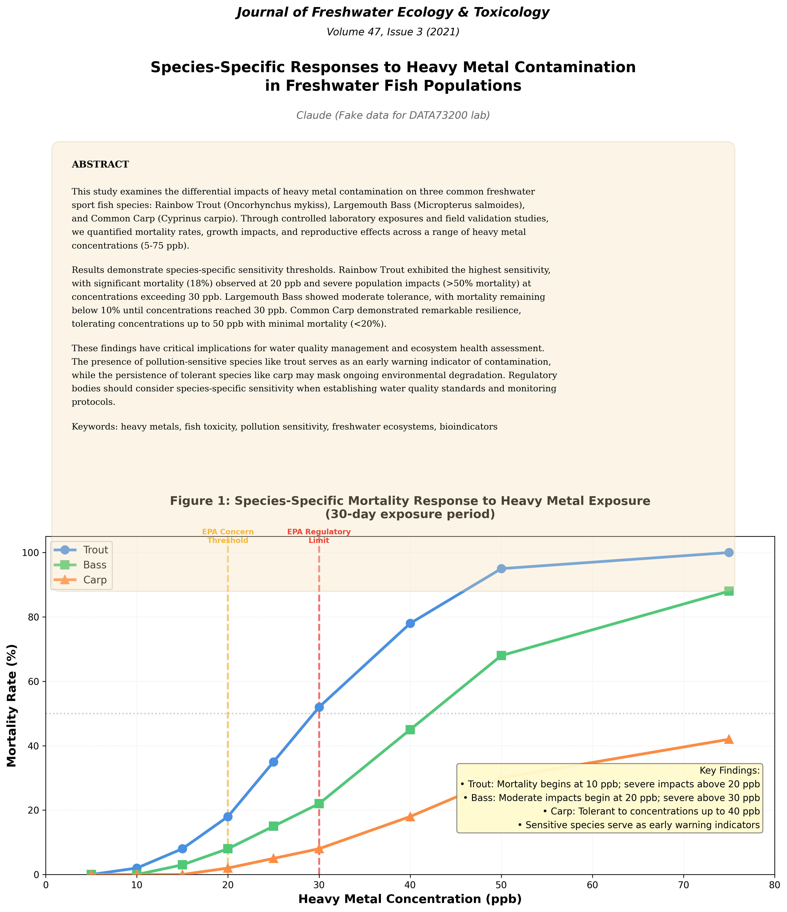

# Lab 4: Clearwater Crisis

The goals for this lab are:

- to build data exploration skillsets with even more ambiguity
- to continue iterating with visualizations to discover data insights
- to hone the data → visualization workflow

For this lab only, you have the option to <b>either</b> follow the lab prompt (the "clearwater crisis") or visualize something else that you may be interested in or want to explore.

<b>However!</b> There are a few parameters around supplying your own data: 
1. Your data must be public, something that you can share publicly, or something that you can anonymize so it can be shared publicly. Your github repository is public and not restricted to members of this class, GC, or CUNY.
2. Your data must have a minimum of ~200 rows and vary in data type. This is intended to keep this lab challenging; most robust datasets could fit this requirement. You can use more than one dataset to achieve this requirement, for example: 
   - Maybe you have personal running data, but its only date and miles, you could expand this to map data, weather details for those dates, journal entries about how you feel, etc. 
   - If you particularly are interested in a (W)NBA team, but you only have games and scores, maybe expand to include roster changes midseason, or basketball basket position, or geographical location of the game, etc. 
3. You don't spend more than ~3 hours sourcing or building this data. This is less a requirement and more a recommendation, but finding, cleaning, and parsing data is often the hardest part of data visualization. Providing you with data in the labs is intended to keep your focus on the visualizations and how to build them. 

The assignment requirements, either for your own data or clearwater crisis data, are as follows:

1. Create a storytelling or exploratory dashboard in the `index.md` file of visualizations with Observable Plot (or d3, if you feel comfortable). 
    - If you choose to supply your own data, your dashboard should present some insight and/or explore the answer to some question.
    - If you choose to explore the clearwater crisis, your dashboard should present a case for who you think is responsible for the ecosystem in crisis at lake clearwater. 
2. You are not restricted in number or style of visualizations, but you will be graded on the following, as per our class syllabus: 
    - On time submission 
    - Technical requirements met
    - Thoughtful responses to research questions (if applicable)
    - Well articulated data presentations
    - Design considerations
3. Submit your [deployed link](#4-set-up-your-github-pages-for-your-deployment) as a comment on the lab 4 commons post.

---

# Data Context

Lake Clearwater was once a thriving recreational lake with healthy fish populations and clear waters. However, over the past two years, something has gone terribly wrong. Fish populations have crashed, particularly among sensitive species like trout. Water quality has degraded in certain areas of the lake.

Your job is to analyze the data and determine which of the four suspects operating around the lake is responsible for the ecological collapse.

The fish population readings are in the `fish_surveys.csv` file. The `monitoring_stations.csv` can tell you each station's position in the lake, and each `water_quality.csv` measurement is associated with a particular station. The `suspect_activities.csv` file can tell you what we know about each of the four suspects and possible contributing activities. 

## Suspects

**Riverside Farm (Northern Shore)**
- Operations: 500-acre agricultural operation growing corn and soybeans
- Location: Northern shore with direct runoff into lake tributaries
- Possible contributing factors:
  - Applies nitrogen fertilizer in spring (April-May) and fall (September)
  - Uses phosphorus-based fertilizers
  - Standard farming operations

**Clearwater Fishing Lodge (Southern Shore)**
- Operations: Recreational fishing lodge and guide service
- Location: Southern shore
- Possible contributing factors: 
  - Grand opening in January 2023 (coinciding with start of fish decline)
  - Guided fishing tours (removing fish from lake)
  - Increased boat traffic; Boat fuel and oil usage
  - Septic system for lodge facilities
  - New dock construction

**Lakeview Resort (Eastern Shore)**
- Operations: Hotel and marina complex serving 200+ guests
- Location: Eastern shore
- Possible contributing factors: 
  - Allowed a daily discharge limit: 0.3 kg heavy metals maximum (from wastewater treatment)
  - Expanded operations in 2023-2024 with new construction
  - Marina operations with boat traffic
  - Operates wastewater treatment facility

**ChemTech Manufacturing (Western Shore)**
- Operations: Industrial chemical manufacturing facility
- Location: Western shore where water enters the lake
- Possible contributing factors:
  - Allowed a daily discharge limit of 2.5 kg heavy metals maximum
  - Quarterly maintenance shutdowns requiring temporary process changes
  - Subject to daily monitoring and reporting; violations trigger EPA enforcement actions

## Water Quality Standards

Lake Clearwater is monitored by the state EPA. Violations of these standards trigger enforcement:

| Parameter | Concern Threshold | Regulatory Limit | Description |
|-----------|------------------|------------------|-------------|
| **Heavy Metals** | 20 ppb | 30 ppb | Levels above 20 ppb harm sensitive fish; above 30 ppb violates permit |
| **Nitrogen** | 1.5 mg/L | 2.0 mg/L | Excess causes algae blooms |
| **Phosphorus** | 0.05 mg/L | 0.1 mg/L | Excess causes eutrophication |
| **Dissolved Oxygen** | 7 mg/L (ideal) | 5 mg/L (minimum) | Below 5 mg/L threatens fish survival |
| **pH** | 6.5-8.5 | 6.0-9.0 | Acceptable range for aquatic life |
| **Turbidity** | 10 NTU | 25 NTU | Higher values reduce light penetration |

## Datasets

### water_quality.csv (~420 rows)
Weekly water quality measurements from 4 monitoring stations (North, South, East, West).

| Column Name | Type | Range/Values | Description |
|-------------|------|--------------|-------------|
| **date** | Date | 2023-01-01 to 2024-12-31 | Date of measurement (weekly samples) |
| **station_id** | Categorical | North, South, East, West | Station identifier |
| **station_name** | Categorical | 4 stations | Readable station name |
| **nitrogen_mg_per_L** | Numeric | 0.6-2.5 mg/L | Nitrogen concentration |
| **phosphorus_mg_per_L** | Numeric | 0.02-0.10 mg/L | Phosphorus concentration |
| **heavy_metals_ppb** | Numeric | 8-75 ppb | Heavy metal concentration (industrial pollutant) |
| **turbidity_ntu** | Numeric | 3-30 NTU | Water cloudiness/sediment |
| **ph** | Numeric | 6.5-7.6 | Acidity/alkalinity |
| **dissolved_oxygen_mg_per_L** | Numeric | 4.5-9.5 mg/L | Oxygen available for fish |
| **temperature_celsius** | Numeric | 4-28°C | Water temperature |

### monitoring_stations.csv (4 rows)
Information about station locations and distances from suspects.

| Column Name | Type | Range/Values | Description |
|-------------|------|--------------|-------------|
| **station_id** | Categorical | North, South, East, West | Station identifier |
| **station_name** | Categorical | 4 stations | Readable name |
| **distance_to_chemtech_m** | Numeric | 800-5400 meters | Distance from ChemTech facility |
| **distance_to_farm_m** | Numeric | 600-5200 meters | Distance from Riverside Farm |
| **distance_to_resort_m** | Numeric | 700-4600 meters | Distance from Lakeview Resort |
| **distance_to_lodge_m** | Numeric | 800-5600 meters | Distance from Clearwater Fishing Lodge |
| **water_depth_m** | Numeric | 7-11 meters | Depth at monitoring location |

### fish_surveys.csv (~96 rows)
Quarterly biological surveys conducted at each station (January, April, July, October).

| Column Name | Type | Range/Values | Description |
|-------------|------|--------------|-------------|
| **date** | Date | Quarterly 2023-2024 | Date of survey |
| **station_id** | Categorical | North, South, East, West | Station where survey conducted |
| **species** | Categorical | Trout, Bass, Carp | Fish species |
| **pollution_sensitivity** | Categorical | High, Medium, Low | Sensitivity classification |
| **count** | Integer | 5-60+ | Number of fish caught in standardized survey |
| **avg_length_cm** | Numeric | 24-43 cm | Average length (health indicator) |
| **avg_weight_g** | Numeric | 380-1300 g | Average weight (health indicator) |

### suspect_activities.csv (~20 rows)
Timeline of documented activities by each suspect.

| Column Name | Type | Range/Values | Description |
|-------------|------|--------------|-------------|
| **date** | Date | 2023-2024 | Date of activity |
| **suspect** | Categorical | 4 suspects | Which suspect performed activity |
| **activity_type** | Categorical | Various | Type of activity (maintenance, construction, etc.) |
| **intensity** | Categorical | Low, Medium, High | Activity intensity |
| **duration_days** | Integer | 1-730 days | How long activity lasted |
| **notes** | Text | Various | Additional context |

---

## Hints

Open these if you're floundering like a trout on clearwater lake, but I encourage you to explore on your own before reading:

  
Hint #1

  

  A recent study was published about species specific responses to heavy metal contamination in freshwater fish populations. Here's an image of the abstract and relevant chart: 
  
  

  
Hint #2

  

  Look at fish populations at your worst station vs. other stations. Which species declined? Check the scientific paper - what do those mortality rates tell you about contamination levels?

  
Hint #3

  

  You're looking for a pattern where ONE suspect matches ALL three dimensions:
  <ul>
    <li>Spatial (closest to worst contamination)</li>
    <li>Temporal (their activities align with pollution spikes)</li>
    <li>Biological (observed pollution levels match expected fish mortality)</li>
    </ul>
  

